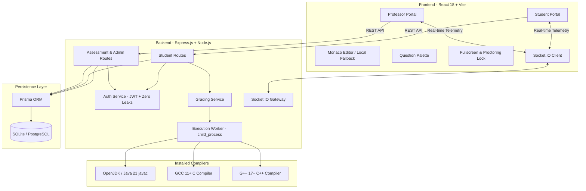
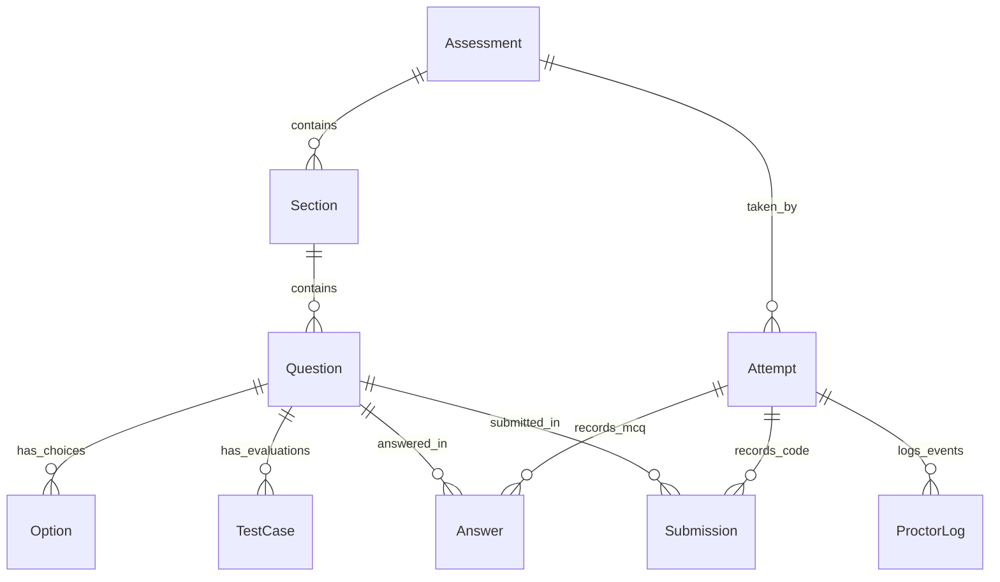
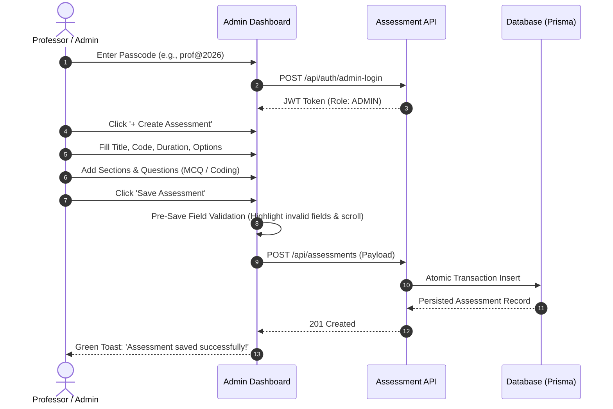
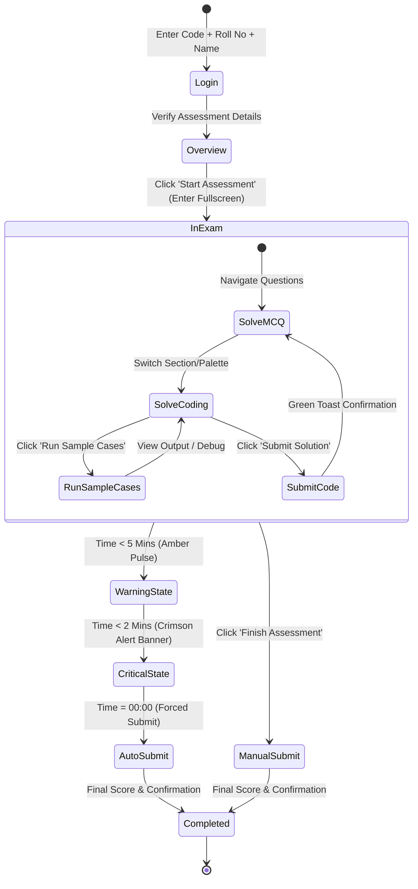
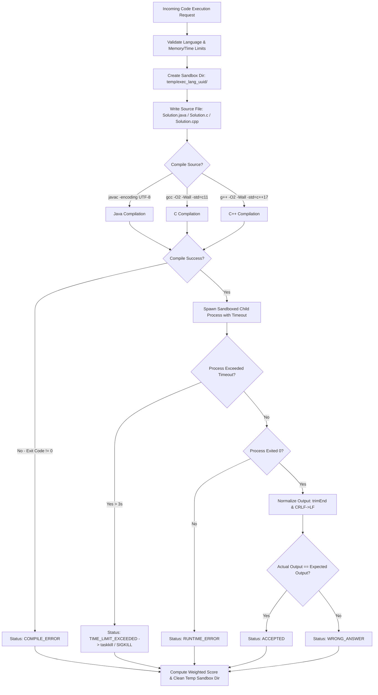
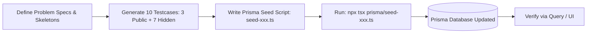

# 🚀 Assessment Platform – Complete System Knowledge & Operational Workflow

Welcome to the definitive system knowledge base and workflow manual for the **Online Coding & MCQ Assessment Platform**. This document provides an exhaustive, end-to-end guide covering system architecture, user journeys, instructor operations, student flows, code execution engine internals, security guardrails, content seeding, and deployment runbooks.

---

## 📑 Table of Contents

1. [System Architecture & Technology Stack](#1-system-architecture--technology-stack)
2. [Data Model & Entity Relationships](#2-data-model--entity-relationships)
3. [Workflow A: Professor / Instructor Operations](#3-workflow-a-professor--instructor-operations)
   - [3.1 Authentication & Security](#31-authentication--security)
   - [3.2 Creating & Authoring Assessments](#32-creating--authoring-assessments)
   - [3.3 MCQ Authoring Standards](#33-mcq-authoring-standards)
   - [3.4 Coding Question Authoring Standards (10-Testcase Rule)](#34-coding-question-authoring-standards-10-testcase-rule)
   - [3.5 Pre-Save Form Validation & Auto-Scroll](#35-pre-save-form-validation--auto-scroll)
   - [3.6 Live Monitoring & Proctoring Dashboard](#36-live-monitoring--proctoring-dashboard)
   - [3.7 Results, Evaluation & Gradebook](#37-results-evaluation--gradebook)
   - [3.8 Secure Logout SOP](#38-secure-logout-sop)
4. [Workflow B: Student Candidate Assessment Journey](#4-workflow-b-student-candidate-assessment-journey)
   - [4.1 Authentication & Access Code Entry](#41-authentication--access-code-entry)
   - [4.2 Assessment Overview & Instructions](#42-assessment-overview--instructions)
   - [4.3 Proctoring, Fullscreen & Focus Tracking](#43-proctoring-fullscreen--focus-tracking)
   - [4.4 Navigation & Question Palette](#44-navigation--question-palette)
   - [4.5 Attempting MCQ Questions](#45-attempting-mcq-questions)
   - [4.6 Attempting Coding Questions (Monaco & Fallback)](#46-attempting-coding-questions-monaco--fallback)
   - [4.7 Multi-Language Switching & Skeleton Code](#47-multi-language-switching--skeleton-code)
   - [4.8 Compiling, Running & Submitting Code](#48-compiling-running--submitting-code)
   - [4.9 Timer Stages & Critical Urgency Alerts](#49-timer-stages--critical-urgency-alerts)
   - [4.10 Auto-Save, Network Resilience & Final Submission](#410-auto-save-network-resilience--final-submission)
5. [Workflow C: Code Compilation & Sandboxed Grading Engine](#5-workflow-c-code-compilation--sandboxed-grading-engine)
   - [5.1 Sandbox Execution Pipeline](#51-sandbox-execution-pipeline)
   - [5.2 Compiler Specifications & Flags](#52-compiler-specifications--flags)
   - [5.3 Process Isolation & Security Sandboxing](#53-process-isolation--security-sandboxing)
   - [5.4 Output Normalization & Scoring Formulas](#54-output-normalization--scoring-formulas)
   - [5.5 Execution Status Taxonomy](#55-execution-status-taxonomy)
6. [Workflow D: Content Generation & Database Seeding Runbook](#6-workflow-d-content-generation--database-seeding-runbook)
   - [6.1 Seed Script Architecture](#61-seed-script-architecture)
   - [6.2 Blind 75 Assessment Suite](#62-blind-75-assessment-suite)
   - [6.3 Custom Test Suites (Test1, Test2)](#63-custom-test-suites-test1-test2)
   - [6.4 Step-by-Step Guide for Creating New Seed Scripts](#64-step-by-step-guide-for-creating-new-seed-scripts)
7. [Workflow E: Platform Guardrails & UX Fail-Safes](#7-workflow-e-platform-guardrails--ux-fail-safes)
   - [7.1 Offline Monaco Bundling & 2.5s Instant Fallback](#71-offline-monaco-bundling--25s-instant-fallback)
   - [7.2 Monaco Undo/Redo Isolation](#72-monaco-undoredo-isolation)
   - [7.3 Pure Single-Click Item Additions](#73-pure-single-click-item-additions)
   - [7.4 Intra-Section Question Shuffling](#74-intra-section-question-shuffling)
   - [7.5 Terminal Console Auto-Reset](#75-terminal-console-auto-reset)
8. [Workflow F: Deployment, Maintenance & Troubleshooting](#8-workflow-f-deployment-maintenance--troubleshooting)
   - [8.1 Development & Production Startup](#81-development--production-startup)
   - [8.2 Database Migrations & Maintenance](#82-database-migrations--maintenance)
   - [8.3 Lab Air-Gapped Deployment](#83-lab-air-gapped-deployment)
   - [8.4 Troubleshooting Matrix](#84-troubleshooting-matrix)

---

# 1. System Architecture & Technology Stack

The platform is structured as a modern client-server architecture engineered for high concurrency, air-gapped lab compatibility, low-latency code execution, and high security.



### Core Tech Stack

| Layer | Technologies | Key Design Features |
| :--- | :--- | :--- |
| **Frontend** | React 18, TypeScript, Vite, Tailwind CSS, Lucide Icons | Zero CDN runtime dependency, bundled assets, responsive desktop/tablet UI. |
| **Code Editor** | Monaco Editor (`@monaco-editor/react`), Local Fallback Editor | Offline local bundling (`loader.config({ monaco })`), 2.5s fallback failsafe, undo isolation. |
| **Backend** | Express.js, TypeScript, Node.js (v18+) | Async child process execution, strict timeout controls, RESTful APIs. |
| **Database** | Prisma ORM, SQLite (`prisma/dev.db`) / PostgreSQL | Relational integrity, cascade deletions, JSON serialization for starter code & test cases. |
| **Execution** | Child process sandboxing, GCC (w64devkit/MinGW/LLVM), Java 21 | Isolated per-execution directory, process group killing (`taskkill /T /F` / `SIGKILL`), output trimming. |
| **Real-time** | Socket.IO | Live candidate focus loss alerts, timer synchronization, heartbeat monitoring. |

---

# 2. Data Model & Entity Relationships

The Prisma schema (`server/prisma/schema.prisma`) organizes assessments hierarchically:



### Entity Schema Highlights:
* **`Assessment`**: `title`, `code` (unique uppercase access code), `durationMinutes`, `startTime`, `endTime`, `shuffleQuestions` (intra-section), `requireSeb`, `isReviewUnlocked`.
* **`Section`**: `title` (e.g., "Section A: Multiple Choice", "Section B: Coding"), `order`, `assessmentId`.
* **`Question`**: `type` (`MCQ` or `CODING`), `title`, `description`, `marks`, `negativeMarks`, `order`, `allowedLanguages` (`"JAVA,C,CPP"`), `timeLimitSeconds` (default 3s), `memoryLimitMb` (default 256MB), `starterCodes` (JSON mapping `JAVA`, `C`, `CPP`).
* **`TestCase`**: `input`, `expectedOutput`, `isPublic` (true for open sample test cases, false for closed evaluation test cases), `weight`, `order`.
* **`Attempt`**: `studentRollNo`, `studentName`, `status` (`IN_PROGRESS`, `SUBMITTED`, `TIME_EXPIRED`), `score`, `tabSwitches`, `startedAt`, `submittedAt`.
* **`Submission`**: `language`, `code`, `status` (`ACCEPTED`, `WRONG_ANSWER`, `COMPILE_ERROR`, etc.), `passedTestCases`, `totalTestCases`, `scoreAwarded`.

---

# 3. Workflow A: Professor / Instructor Operations



### 3.1 Authentication & Security
* **Endpoint**: `POST /api/auth/admin-login`
* **Passcode Validation**: Validated strictly against server environment variable `ADMIN_PASSCODE` (default: `prof@2026`).
* **Zero Credential Leakage Guardrail**:
  - Failed logins return a generic error: `"Invalid professor security passcode. Access denied."`
  - No suggested hints, debug samples, or default passwords in error payloads or UI.
  - Form fields are never pre-filled for unauthenticated clients.

### 3.2 Creating & Authoring Assessments
1. Navigate to `/admin/assessments/new` (or edit existing via `/admin/assessments/:id/edit`).
2. Configure **Header Metadata**:
   - **Assessment Title**: Descriptive name (e.g., `"Test2"` or `"Mid-Semester Algorithms Assessment"`).
   - **Access Code**: Unique alphanumeric token (e.g., `"TEST2"`, `"B75-1"`). Automatically converted to uppercase.
   - **Duration**: Duration in minutes (e.g., 60 mins).
   - **Time Window**: Optional start time and end time.
   - **Intra-Section Shuffling**: Toggle to randomize question order *within* each section while preserving overall section ordering.
   - **Safe Exam Browser (SEB)**: Toggle to require SEB headers and configure SEB quit passcode.

### 3.3 MCQ Question Authoring Standards
* **Question Type**: Single Correct (`radio`) or Multiple Correct (`checkbox`).
* **Marks**: Positive marks awarded on exact match.
* **Negative Marking**: Optional penalty (e.g., 0.25 or 1.0) deducted for incorrect answers.
* **Options**: Minimum 2 options. Add options with single-click '+ Add Option'.
* **Correct Answer Marking**: Select the radio button or checkboxes corresponding to the correct answer keys.

### 3.4 Coding Question Authoring Standards (The 10-Testcase Rule)
Every standard coding problem must adhere to the following institutional authoring standard:
1. **Clean Problem Statement**:
   - Concise summary with clear problem formulation.
   - Clear **Input Format** (e.g., Line 1: `n`, Line 2: space-separated elements).
   - Clear **Output Format** (deterministic output formatting, e.g., space-separated sorted list).
   - **Constraints** (explicit upper and lower bounds for all variables, e.g., $1 \le n \le 10,000$).
2. **Detailed Test Case Explanation**:
   - Provide a step-by-step mathematical or algorithmic walkthrough of at least one public test case.
3. **Multi-Language Starter Code Skeletons**:
   - Supported languages: **Java 21**, **C11**, **C++17**.
   - **Zero Solution Leakage**: Starter codes must only provide standard I/O parsing scaffolding and a `// TODO:` marker. No full or partial logic solutions.
4. **10-Testcase Distribution**:
   - **3 Public (Open) Test Cases**: Visible in student problem statement with inputs and expected outputs.
   - **7 Hidden (Closed) Test Cases**: Evaluated securely on backend. Covers edge cases:
     - Disjoint / empty cases
     - Single element / minimum constraint
     - Repeated identical values / extreme duplicates
     - Negative numbers & zero values
     - Reverse order / max constraints
     - Symmetry and scale limits

### 3.5 Pre-Save Form Validation & Auto-Scroll
* **Validation Triggers**: On clicking "Save Assessment".
* **Enforced Fields**: Assessment Title, Code, Duration, Section Titles, Question Titles, Positive Marks, MCQ Option Text, at least one Selected Correct Answer.
* **UX Feedback**:
  - Invalid inputs glow with crimson border: `border-rose-500 ring-1 ring-rose-500/50`.
  - Viewport **smoothly scrolls to the first invalid field** and focuses it automatically.
  - Animated green confirmation toast appears only upon verified successful persistence.

### 3.6 Live Monitoring & Proctoring Dashboard
* Accessible via `/admin/assessments/:id/monitor`.
* **Real-time Telemetry (Socket.IO)**:
  - Active candidate count.
  - Individual student progress: current question, time remaining, answered count.
  - **Focus Loss Counter**: Displays count of tab-switches or fullscreen exits with timestamped audit logs.

### 3.7 Results, Evaluation & Gradebook
* Accessible via `/admin/assessments/:id/results` and `/admin/assessments/:id/gradebook`.
* **Automated Aggregation**:
  - Total Score = $\sum \text{MCQ Scores (with negative deductions)} + \sum \text{Coding Scores (weighted testcases)}$.
  - Percentage and Class Rank computed automatically.
* **Per-Candidate Drill-Down**:
  - Submitted source code per language.
  - Testcase pass/fail breakdown with execution runtime in milliseconds.
  - Option to manually adjust scores or invalidate compromised attempts.
  - Export full gradebook to CSV.

### 3.8 Secure Instructor Logout SOP
* Clicking 'Logout' triggers a modal confirmation: *"Confirm Instructor Logout?"*.
* Prevents accidental termination of instructor sessions during live exam monitoring.

---

# 4. Workflow B: Student Candidate Assessment Journey



### 4.1 Authentication & Access Code Entry
1. Student accesses root URL `/` or `/student/login`.
2. Inputs:
   - **Assessment Code**: Case-insensitive (e.g., `test2` $\rightarrow$ `TEST2`).
   - **Roll Number / Register Number**: Unique identifier (e.g., `2026CS101`).
   - **Full Name**: Candidate's name.
3. System verifies assessment status (active time window, draft vs published).

### 4.2 Assessment Overview & Instructions
* Displays exam title, duration, section breakdown, total marks, negative marking policy, and language permissions.
* Student clicks **"Start Assessment"** to begin the timed attempt.

### 4.3 Proctoring, Fullscreen & Focus Tracking
* **Fullscreen Lock**: Attempt immediately enters fullscreen mode (`document.documentElement.requestFullscreen()`).
* **Tab-Switch & Blur Tracking**:
  - `window.addEventListener('blur')` and `document.addEventListener('visibilitychange')` detect window changes.
  - Event recorded via `POST /api/student/proctor-log` and broadcast to instructor live monitor.
  - Student receives a warning notification on returning to the screen.

### 4.4 Navigation & Question Palette
* Left/Top Navigation Palette color codes every question:
  - ⚪ **Gray**: Unvisited / Not Attempted.
  - 🔵 **Blue**: Current Active Question.
  - 🟢 **Green**: Answered / Code Submitted.
  - 🟣 **Purple**: Marked for Review.
* Direct jumping to any question allowed without rigid linear progression.

### 4.5 Attempting MCQ Questions
* Candidate selects answer option(s).
* Answer is **auto-saved instantly** via background API request (`POST /api/student/save-answer`).
* "Clear Selection" button allows unselecting answers to avoid negative mark penalties.
* "Mark for Review" button toggles the purple flag in the question palette.

### 4.6 Attempting Coding Questions (Monaco & Local Fallback)
* **Zero CDN Dependency**: Monaco Editor is initialized locally from bundled assets.
* **2.5s Instant Fallback**: If Monaco encounters any initialization delay in restricted environments, the system seamlessly transitions to the lightweight code editor with synchronized line numbers and 4-space tab indentation.
* **Undo/Redo Isolation**: Monaco editor models are strictly partitioned by URI (`inmemory_question_${questionId}_${language}`). Undo operations (`Ctrl+Z`) in Question 2 will never revert code from Question 1.

### 4.7 Multi-Language Switching & Skeleton Code
* Toggle between **Java 21**, **C11**, and **C++17**.
* Each language maintains its own independent working code state in memory and local storage.
* Starter code contains clean I/O parsing with standard `// TODO:` logic prompts.

### 4.8 Compiling, Running & Submitting Code
* **Run Sample Cases**:
  - Evaluates code against the 3 public open test cases.
  - Displays stdout, stderr, execution time, and expected vs actual comparison.
* **Custom Input**:
  - Run arbitrary custom stdin to verify edge cases.
* **Terminal Auto-Clearing**:
  - Switching to a different question **instantly clears previous stdout/stderr/results**, ensuring zero stale output confusion.
* **Submit Solution**:
  - Evaluates code against all 10 test cases (3 public + 7 hidden).
  - Calculates proportional weighted score.
  - Displays instant floating green confirmation toast: `"Code Submitted Successfully!"`.

### 4.9 Timer Stages & Critical Urgency Alerts
The timer is driven by server-authoritative timestamps to prevent client clock tampering:

| Remaining Time | Visual Theme | Indicator / Banner |
| :--- | :--- | :--- |
| **$> 5$ Minutes** | Slate / Indigo theme | Standard countdown display (`MM:SS`). |
| **$< 5$ Minutes** | Amber / Orange glow | Pulsing amber badge with `'Ending Soon'` indicator. |
| **$< 2$ Minutes** | Deep Crimson Emergency | Bouncing crimson glow, spinning clock icon, and sticky top warning banner: <br>`⚠️ Final Cut-off Warning: Less than 2 minutes remaining! All work will auto-submit at 00:00.` |
| **`00:00`** | System Lockout | Immediate automatic submission and transition to completed screen. |

### 4.10 Auto-Save, Network Resilience & Final Submission
* Periodic auto-save synchronizes draft code and MCQ selections to the backend every 30 seconds and on navigation.
* If a temporary network disconnection occurs, answers remain safely stored in `localStorage` and re-synchronize upon reconnection.
* Final manual submission requires a single click on "Finish Assessment" with confirmation.

---

# 5. Workflow C: Code Compilation & Sandboxed Grading Engine



### 5.1 Sandbox Execution Pipeline
The backend code runner (`server/src/services/codeRunner.ts`) executes each submission in a temporary isolated working directory:
1. Generate unique execution ID via `uuidv4()`.
2. Create dedicated scratch folder: `os.tmpdir()/sandbox_<lang>_<execId>/`.
3. Write clean source code to disk (`Solution.java`, `Solution.c`, or `Solution.cpp`).
4. Execute compilation and binary execution in sequential phases.
5. In a `finally` block, recursively delete `sandbox_<lang>_<execId>/` to prevent disk bloat.

### 5.2 Compiler Specifications & Flags

#### Java (Java 21 / OpenJDK)
* **Source Filename**: Detected dynamically from class definition (`public class Solution` $\rightarrow$ `Solution.java`).
* **Compile Command**: `javac -encoding UTF-8 Solution.java`
* **Run Command**: `java -Xmx256m -Xms32m -Dfile.encoding=UTF-8 -cp . Solution`

#### C (C11 Standard)
* **Compiler Search Priority**: `w64devkit/bin/gcc.exe` $\rightarrow$ `clang` $\rightarrow$ `ucrt64/bin/gcc` $\rightarrow$ `MinGW/bin/gcc` $\rightarrow$ `gcc` in system PATH.
* **Compile Command**: `gcc -O2 -Wall -std=c11 Solution.c -o Solution.exe`
* **Run Command**: `./Solution.exe`

#### C++ (C++17 Standard)
* **Compiler Search Priority**: `w64devkit/bin/g++.exe` $\rightarrow$ `clang++` $\rightarrow$ `ucrt64/bin/g++` $\rightarrow$ `MinGW/bin/g++` $\rightarrow$ `g++` in system PATH.
* **Compile Command**: `g++ -O2 -Wall -std=c++17 Solution.cpp -o Solution.exe`
* **Run Command**: `./Solution.exe`

### 5.3 Process Isolation & Security Sandboxing
* **Execution Timeout**: Enforced via hard process timers (default 3.0s, compilation 7.0s).
* **Process Killing**:
  - Windows: `taskkill /pid <PID> /T /F` (terminates entire process tree).
  - Linux/POSIX: `child.kill('SIGKILL')`.
* **Output Truncation**: Stdout and Stderr are capped at **512 KB** to prevent memory exhaustion from infinite print loops.

### 5.4 Output Normalization & Scoring Formulas
* **Normalization Logic (`normalizeOutput`)**:
  ```ts
  output.replace(/\r\n/g, "\n")
        .split("\n")
        .map(line => line.trimEnd())
        .join("\n")
        .trim();
  ```
* **Score Calculation**:
  $$\text{Score Awarded} = \left(\frac{\sum_{\text{passed}} \text{Weight}_i}{\sum_{\text{all}} \text{Weight}_i}\right) \times \text{Question Marks}$$

### 5.5 Execution Status Taxonomy
* **`ACCEPTED`**: Code compiled, executed within limits, and output exactly matched expected output across all test cases.
* **`WRONG_ANSWER`**: Code ran to completion but output differed from expected output.
* **`COMPILE_ERROR`**: `javac`/`gcc`/`g++` failed with non-zero exit code. Compiler diagnostics captured in `compilationError`.
* **`RUNTIME_ERROR`**: Non-zero exit code, unhandled exception, segfault, null pointer dereference, or out-of-bounds index.
* **`TIME_LIMIT_EXCEEDED`**: Process exceeded specified timeLimitSeconds (e.g., infinite loop).
* **`MEMORY_LIMIT_EXCEEDED`**: Process exceeded JVM `-Xmx` or OS memory limits.

---

# 6. Workflow D: Content Generation & Database Seeding Runbook



### 6.1 Seed Script Architecture
All assessments can be seeded deterministically using TypeScript scripts in `server/prisma/`:
* `seed-blind75.ts`: Populates 25 complete coding assessments (`B75-1` to `B75-25`).
* `seed-test1.ts`: Populates `test1` (Trapping Rain Water & Binary to Decimal).
* `seed-test2.ts`: Populates `Test2` (LeetCode 350 & LeetCode 136).

### 6.2 Blind 75 Assessment Suite
* Spans 25 curated problem sets covering Arrays, Strings, Two Pointers, Sliding Window, Trees, Graphs, Dynamic Programming, and Heaps.
* Code format: `B75-1`, `B75-2`, ..., `B75-25`.
* Default Duration: 60 minutes each.

### 6.3 Custom Test Suites (Test1, Test2)
* **`test1`**:
  - Question 1: Trapping Rain Water (Hard / 50 Marks)
  - Question 2: Binary to Decimal Conversion (Easy / 50 Marks)
* **`Test2`**:
  - Question 1: Intersection of Two Arrays II (LeetCode 350 / 50 Marks)
  - Question 2: Single Number (LeetCode 136 / 50 Marks)

### 6.4 Step-by-Step Guide for Creating New Seed Scripts
To create a new assessment `TestX`:
1. Create `server/prisma/seed-testx.ts`.
2. Follow the standard sequential pattern:
   ```ts
   import { PrismaClient } from "@prisma/client";
   const prisma = new PrismaClient();

   async function main() {
     // 1. Clean existing
     await prisma.assessment.deleteMany({ where: { code: "TESTX" } });

     // 2. Create Assessment
     const assessment = await prisma.assessment.create({
       data: {
         title: "TestX",
         code: "TESTX",
         durationMinutes: 60,
         shuffleQuestions: false,
         requireSeb: false,
       }
     });

     // 3. Create Section
     const section = await prisma.section.create({
       data: {
         assessmentId: assessment.id,
         title: "Section A: Coding Challenges",
         order: 0,
       }
     });

     // 4. Create Question with starterCodes and 10 test cases (3 open, 7 closed)
     await prisma.question.create({
       data: {
         assessmentId: assessment.id,
         sectionId: section.id,
         type: "CODING",
         title: "Problem Name",
         description: "### Problem Statement...",
         marks: 50,
         allowedLanguages: "JAVA,C,CPP",
         starterCodes: JSON.stringify({ JAVA: "...", C: "...", CPP: "..." }),
         testCases: {
           create: [
             { input: "...", expectedOutput: "...", isPublic: true, weight: 1.0, order: 0 },
             // ... 3 public + 7 hidden ...
           ]
         }
       }
     });
   }
   main().finally(() => prisma.$disconnect());
   ```
3. Execute seed:
   ```powershell
   cd server
   npx tsx prisma/seed-testx.ts
   ```

---

# 7. Workflow E: Platform Guardrails & UX Fail-Safes

### 7.1 Offline Monaco Bundling & 2.5s Instant Fallback
* **Problem**: In firewall-restricted labs or offline SEB environments, Monaco's default CDN loader hangs indefinitely.
* **Resolution**:
  - Configured `@monaco-editor/react` to use local bundle: `loader.config({ monaco })`.
  - Added a **2.5-second failsafe timer**. If Monaco initialization does not resolve within 2500ms, the UI switches automatically to a responsive, lightweight syntax-highlighted textarea editor.

### 7.2 Monaco Undo/Redo Isolation
* Every question and language combination is assigned a unique Monaco URI model path:
  ```tsx
  path={`file:///inmemory_question_${questionId}_${selectedLanguage}`}
  ```
* `Ctrl+Z` / `Cmd+Z` and `Ctrl+Y` keybindings are restricted to current question state, eliminating cross-question text corruption.

### 7.3 Pure Single-Click Item Additions
* State handlers in `AdminAssessmentEditor.tsx` use pure, immutable updates with `.map()` to prevent React StrictMode or event bubbling from adding duplicate sections, questions, or MCQ options.

### 7.4 Intra-Section Question Shuffling
* In `server/src/routes/student.ts`, when `shuffleQuestions: true`, shuffling is strictly scoped *within each section array*:
  - Section 1 questions shuffle only among Section 1 questions.
  - Section 2 questions shuffle only among Section 2 questions.
  - Overall section sequence is strictly preserved.

### 7.5 Terminal Console Auto-Reset
* Navigating between questions triggers an immediate reset of `codingResult`, `customResult`, and terminal output states.

---

# 8. Workflow F: Deployment, Maintenance & Troubleshooting

### 8.1 Development & Production Startup

#### Development Mode:
```powershell
# Terminal 1: Backend Server (Port 3000)
cd server
npm run dev

# Terminal 2: Frontend Client (Port 5173)
cd client
npm run dev
```

#### Production Build & Run:
```powershell
# Build Client Assets
cd client
npm run build

# Start Production Backend (serves client/dist if configured)
cd ../server
npm run build
npm start
```

### 8.2 Database Migrations & Maintenance
```powershell
cd server

# Apply pending Prisma schema migrations
npx prisma migrate dev

# Push schema directly to database (prototype/dev)
npx prisma db push

# Launch Prisma Studio Web GUI
npx prisma studio
```

### 8.3 Lab Air-Gapped Deployment
1. Ensure `w64devkit` (GCC/G++) is placed in `server/compilers/w64devkit/` or system PATH.
2. Ensure OpenJDK 21 is installed with `JAVA_HOME` configured.
3. Run `npm run build` in `client/` to verify local Monaco assets are packaged into `dist/assets/`.
4. Launch backend and test assessment access without an active internet connection.

### 8.4 Troubleshooting Matrix

| Symptom / Error | Root Cause | Resolution SOP |
| :--- | :--- | :--- |
| **`gcc: command not found`** | MinGW / w64devkit not found in system PATH. | Ensure `server/compilers/w64devkit/bin/gcc.exe` exists or install MinGW/GCC to system PATH. |
| **`javac: command not found`** | Java Development Kit (JDK) missing or `JAVA_HOME` unset. | Install OpenJDK 21 and add `bin` directory to environment PATH. |
| **Monaco Editor stuck on Loading** | Network CDN blocking in lab / SEB mode. | Local bundle is active by default; fallback editor activates automatically after 2.5s. |
| **`Assessment code already exists`** | Duplicate assessment code collision. | Delete existing assessment via Admin Portal or use `prisma.assessment.delete({ where: { code } })` in seed script. |
| **Accidental student logout** | Browser tab closed or back button pressed. | Student can re-login with same Access Code + Roll Number; timer and submitted code are preserved. |
| **Instructor login rejected** | Incorrect passcode entered. | Ensure passcode matches `ADMIN_PASSCODE` in `server/.env` (default: `prof@2026`). |

---
