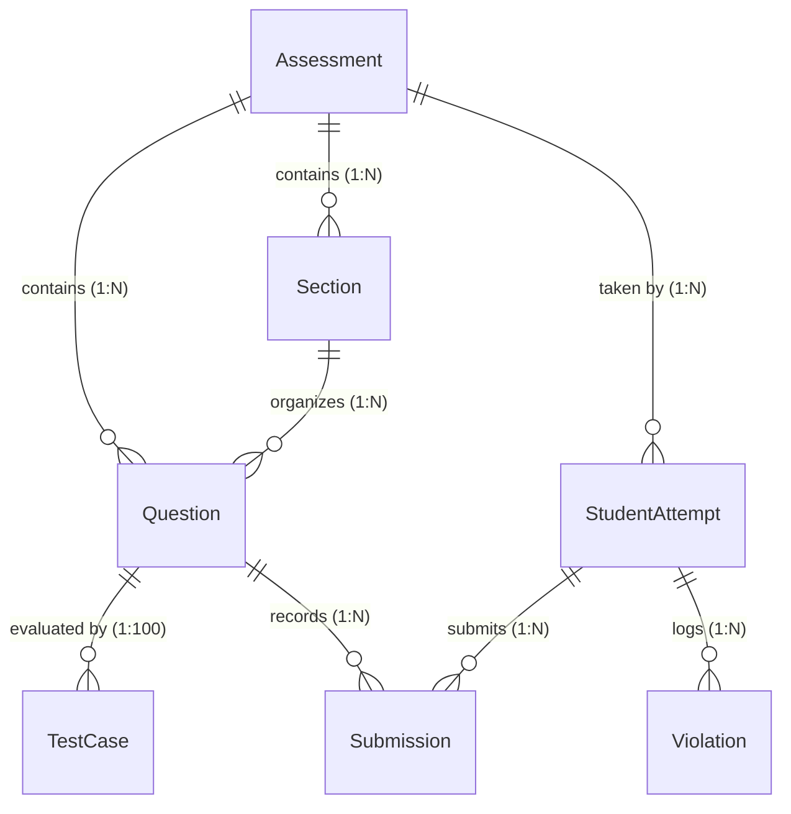

# 🚀 Assessment Platform – Complete System Knowledge & Operational Workflow

Welcome to the definitive system knowledge base and workflow manual for the **Online Coding & MCQ Assessment Platform**. This document provides an exhaustive, end-to-end guide covering system architecture, user journeys, instructor operations, student flows, code execution engine internals, security guardrails, content seeding, and deployment runbooks.

---

## 📑 Table of Contents

1. [System Architecture & Technology Stack](#1-system-architecture--technology-stack)
2. [Data Model & Entity Relationships](#2-data-model--entity-relationships)
3. [Workflow A: Professor / Instructor Operations](#3-workflow-a-professor--instructor-operations)
   - [3.1 Authentication & Security](#31-authentication--security)
   - [3.2 Creating & Authoring Assessments](#32-creating--authoring-assessments)
   - [3.3 MCQ Authoring Standards](#33-mcq-authoring-standards)
   - [3.4 Coding Question Authoring Standards (The 100-Testcase Rule)](#34-coding-question-authoring-standards-the-100-testcase-rule)
   - [3.5 Clean Content Formatting Standards (Zero Stray Symbols)](#35-clean-content-formatting-standards-zero-stray-symbols)
   - [3.6 Pre-Save Form Validation & Auto-Scroll](#36-pre-save-form-validation--auto-scroll)
   - [3.7 Live Monitoring & Proctoring Dashboard](#37-live-monitoring--proctoring-dashboard)
   - [3.8 Results, Evaluation & Gradebook (Code Inspector & Device Tracking)](#38-results-evaluation--gradebook-code-inspector--device-tracking)
   - [3.9 Secure Logout SOP](#39-secure-logout-sop)
4. [Workflow B: Student Candidate Assessment Journey](#4-workflow-b-student-candidate-assessment-journey)
   - [4.1 Authentication & Access Code Entry (IP & Device Logging)](#41-authentication--access-code-entry-ip--device-logging)
   - [4.2 Assessment Overview & Instructions](#42-assessment-overview--instructions)
   - [4.3 Safe Exam Browser (SEB) Security & Violation Policy](#43-safe-exam-browser-seb-security--violation-policy)
   - [4.4 Navigation & Question Palette](#44-navigation--question-palette)
   - [4.5 Attempting MCQ Questions](#45-attempting-mcq-questions)
   - [4.6 Attempting Coding Questions (Monaco & Fallback)](#46-attempting-coding-questions-monaco--fallback)
   - [4.7 Compiling, Running & Test Case Transparency](#47-compiling-running--test-case-transparency)
   - [4.8 Timer Stages & Immutability Guarantee](#48-timer-stages--immutability-guarantee)
   - [4.9 Auto-Save, Socket Isolation & Final Auto-Submission](#49-auto-save-socket-isolation--final-auto-submission)
5. [Workflow C: Code Compilation & Sandboxed Grading Engine](#5-workflow-c-code-compilation--sandboxed-grading-engine)
   - [5.1 Sandbox Execution Pipeline](#51-sandbox-execution-pipeline)
   - [5.2 Compiler Specifications & Flags](#52-compiler-specifications--flags)
   - [5.3 Process Isolation & Security Sandboxing](#53-process-isolation--security-sandboxing)
   - [5.4 Output Normalization & Scoring Formulas](#54-output-normalization--scoring-formulas)
   - [5.5 Execution Status Taxonomy](#55-execution-status-taxonomy)
6. [Workflow D: Content Generation & Database Seeding Runbook](#6-workflow-d-content-generation--database-seeding-runbook)
   - [6.1 Seed Script Architecture & Canonical Algorithm Verification](#61-seed-script-architecture--canonical-algorithm-verification)
   - [6.2 Assessment B2 Suite (Maximum Product, Counting Bits, Grid Unique Path)](#62-assessment-b2-suite-maximum-product-counting-bits-grid-unique-path)
   - [6.3 Step-by-Step Guide for Creating New Seed Scripts (100 Test Cases)](#63-step-by-step-guide-for-creating-new-seed-scripts-100-test-cases)
7. [Workflow E: Platform Guardrails & UX Fail-Safes](#7-workflow-e-platform-guardrails--ux-fail-safes)
   - [7.1 Offline Monaco Bundling & 2.5s Instant Fallback](#71-offline-monaco-bundling--25s-instant-fallback)
   - [7.2 Socket Room Isolation (No Broadcast Leaks)](#72-socket-room-isolation-no-broadcast-leaks)
   - [7.3 Anti-Reset Timer Architecture](#73-anti-reset-timer-architecture)
   - [7.4 Intra-Section Question Shuffling](#74-intra-section-question-shuffling)
   - [7.5 Automated SEB Termination on Finish](#75-automated-seb-termination-on-finish)
8. [Workflow F: Deployment, Maintenance & Troubleshooting](#8-workflow-f-deployment-maintenance--troubleshooting)
   - [8.1 Development & Production Startup](#81-development--production-startup)
   - [8.2 Database Migrations & Maintenance](#82-database-migrations--maintenance)
   - [8.3 Lab Air-Gapped Deployment](#83-lab-air-gapped-deployment)
   - [8.4 Troubleshooting Matrix](#84-troubleshooting-matrix)

---

# 1. System Architecture & Technology Stack

The platform is structured as a modern client-server architecture engineered for high concurrency, air-gapped lab compatibility, low-latency code execution, and high security.

```mermaid
graph TD
    subgraph Client [Frontend - React 18 + Vite + Tailwind CSS]
        SP[Student Portal]
        PP[Professor Portal / Gradebook]
        ME[Monaco Editor / Local Fallback]
        QP[Question Palette]
        TRV[TestResultViewer - All / Failed / Passed]
        WS_C[Socket.IO Client - Private Student Room]
    end

    subgraph Server [Backend - Express.js + Node.js + TypeScript]
        AUTH[Auth Service - JWT + Role Guard]
        STU_R[Student Routes - IP & Device Capture]
        ADM_R[Assessment & Admin Routes - Auto-Sanitizer]
        GRD[Grading Service - Test Case Evaluation]
        CR[CodeRunner - Sandboxed Java/C/C++ Sandbox]
        WS_S[Socket.IO Server - Isolated student:attemptId Rooms]
    end

    subgraph Database [Storage - SQLite via Prisma ORM]
        DB[(dev.db)]
    end

    SP -->|HTTPS / REST API| STU_R
    PP -->|HTTPS / REST API| ADM_R
    WS_C <-->|WebSockets (Isolated)| WS_S
    STU_R & ADM_R & GRD --> DB
    GRD --> CR
```

---

# 2. Data Model & Entity Relationships


```mermaid
erDiagram
    Assessment ||--o{ Section : "contains (1:N)"
    Assessment ||--o{ Question : "contains (1:N)"
    Assessment ||--o{ StudentAttempt : "taken by (1:N)"
    Section ||--o{ Question : "organizes (1:N)"
    Question ||--o{ TestCase : "evaluated by (1:100)"
    Question ||--o{ Submission : "records (1:N)"
    StudentAttempt ||--o{ Submission : "submits (1:N)"
    StudentAttempt ||--o{ Violation : "logs (1:N)"
```

* **`Assessment`**: `title`, `code` (unique uppercase access code), `durationMinutes`, `startTime`, `endTime`, `shuffleQuestions`, `requireSeb` (default `true`), `sebQuitPassword` (default `"exit123"`), `isReviewUnlocked`.
* **`Section`**: `title`, `order`, `assessmentId`.
* **`Question`**: `type` (`MCQ` or `CODING`), `title`, `description` (sanitized, zero stray symbols), `marks`, `negativeMarks`, `order`, `allowedLanguages` (`"JAVA"`), `timeLimitSeconds` (default 3s), `memoryLimitMb` (default 256MB), `starterCodes` (JSON mapping).
* **`TestCase`**: `input`, `expectedOutput`, `isPublic` (`true` for full testcase visibility), `weight`, `order`.
* **`StudentAttempt`**: `rollNo`, `studentName`, `status` (`IN_PROGRESS`, `SUBMITTED`, `TIME_EXPIRED`), `remainingSeconds`, `startedAt`, `lastHeartbeat`, `drafts` (JSON map), `ipAddress` (IPv4 address), `deviceInfo` (OS/Platform/Browser/Screen metadata), `violationCount`.
* **`Violation`**: `attemptId`, `violationType` (`SEB_EXIT`, `SEB_TAMPER`), `details`, `ipAddress`, `timestamp`, `resolved`.
* **`Submission`**: `questionId`, `type`, `language`, `code`, `score`, `passedTestCases`, `totalTestCases`, `status`, `testCaseResults` (JSON array of result objects), `submittedAt`.

---

# 3. Workflow A: Professor / Instructor Operations

### 3.1 Authentication & Security
* **Endpoint**: `POST /api/auth/admin-login`
* **Passcode Validation**: Validated strictly against server environment variable `ADMIN_PASSCODE` (default: `prof@2026`).
* **Zero Credential Leakage Guardrail**: Failed logins return a generic error. No debug hints or prefilled forms.

### 3.2 Creating & Authoring Assessments
1. Navigate to `/admin/assessments/new` (or edit existing via `/admin/assessments/:id/edit`).
2. Header Metadata:
   - **Title**: Descriptive assessment title.
   - **Access Code**: Alphanumeric token (e.g., `B2`, `TEST1`), auto-uppercased.
   - **Duration**: Duration in minutes (e.g., 60 mins).
   - **Safe Exam Browser (SEB)**: Checked by default (`requireSeb: true`, `sebQuitPassword: "exit123"`).

### 3.3 MCQ Authoring Standards
* Single Correct or Multiple Correct.
* Positive marks on exact match, optional negative penalty for incorrect selections.
* Minimum 2 options, clear question formulations without confusing negative phrases.

### 3.4 Coding Question Authoring Standards (The 100-Testcase Rule)
Every standard coding problem must adhere strictly to the **100-Testcase Rule**:
1. **100 Automated Test Cases per Problem**: Exactly 100 test cases covering:
   - Sample cases from problem description (1-10)
   - Single elements & boundary extremes (11-20)
   - Zero, one, negative numbers, all-negative values (21-40)
   - Alternating signs, duplicates, sorted, reverse-sorted sequences (41-60)
   - Scale limits & stress test cases (61-100) verifying algorithmic complexity (e.g. O(N) or O(N log N) vs O(N^2)).
2. **Complete Test Case Visibility**:
   - Every test case must have `isPublic: true` so students can see which test cases failed even when several pass.
   - Students can inspect expected output vs. actual stdout and error logs.
3. **Java Boilerplate & I/O**:
   - Every coding problem must provide a complete, working Java starter boilerplate reading from `System.in` and outputting to `System.out`.

### 3.5 Clean Content Formatting Standards (Zero Stray Symbols)
All question content (titles, descriptions, explanations) must be clean plain text:
- **NO `*`**: Never use `*` for multiplication; write `x` instead (e.g., `(-2) x 3 x (-4) = 24`). Do not leave raw markdown asterisks (`**` or `*`) in description text.
- **NO `$`**: Do not use LaTeX math delimiters like `$N \le 100$`. Write clear plain text: `N <= 100`, `O(N)`.
- **NO `#`**: Do not use markdown heading symbols (`#`, `##`). Use plain-text section titles (`Problem Statement:`, `Input Format:`, `Output Format:`, `Examples:`).
- *Automated Enforcement*: The backend automatically runs `sanitizeQuestionContent()` on every question create and update to guarantee adherence.

### 3.6 Pre-Save Form Validation & Auto-Scroll
* Validates title, code, question titles, marks, and test case data.
* Viewport smoothly auto-scrolls to the first invalid field with visual crimson focus.

### 3.7 Live Monitoring & Proctoring Dashboard
* Accessible via `/admin/assessments/:id/monitor`.
* Shows active student count, individual progress, answered questions, and SEB infractions.

### 3.8 Results, Evaluation & Gradebook (Code Inspector & Device Tracking)
* Accessible via `/admin/assessments/:id/gradebook`.
* **Automated Aggregation**: Total score awarded proportionally based on passed test cases.
* **Student Code Inspector Modal**:
  - Click **"View Code"** on any student to open the comprehensive inspection modal.
  - View full submitted source code per question with syntax highlighting and copy button.
  - Inspect testcase pass/fail counts, execution times, and errors.
  - Displays student's verified **IPv4 Address** and **Device / System Information** (OS, platform, browser, screen resolution).
  - Export full student responses and grades to CSV.

### 3.9 Secure Logout SOP
* Instructor logout requires explicit modal confirmation to prevent accidental loss of live exam supervision.

---

# 4. Workflow B: Student Candidate Assessment Journey

### 4.1 Authentication & Access Code Entry (IP & Device Logging)
1. Student opens assessment URL in Safe Exam Browser.
2. Inputs Access Code, Roll Number, Full Name.
3. Client automatically detects device parameters via `getClientDeviceInfo()` (OS, platform, browser, screen resolution) and sends them to the server.
4. Server extracts client IPv4 address from connection headers and records both in `StudentAttempt`.

### 4.2 Assessment Overview & Instructions
* Displays exam rules, question count, and duration.
* Countdown timer is initialized when candidate enters the assessment.

### 4.3 Safe Exam Browser (SEB) Exclusivity & Zero Proctor Override
* **Mandatory SEB Access**:
  - The assessment strictly mandates Safe Exam Browser (`requireSeb: true`).
  - **Zero Proctor Override**: Bypassing, overriding, or testing without SEB is strictly prohibited and disabled in both the client UI and server API. Non-SEB requests receive HTTP 403.
  - **NO Intrusive Browser Overlay Hacks**: Intrusive in-browser lockdown shields, fullscreen traps, and selection blocking are removed in favor of native SEB operating system level isolation.
* **SEB Launch Architecture & Gatekeeper Loop Prevention**:
  - **Protocol Link Target**: `seb://` and `sebs://` 1-click links point directly to `/api/assessments/:id/seb-config` (never `/?code=...` which serves HTML). SEB expects an XML plist from `seb://` endpoints; pointing to HTML causes plist parsing failure.
  - **XML Plist Compliant Escaping**: Special characters in configuration URLs (notably `&` in query strings such as `&sebToken=...`) are escaped as `&amp;` to ensure strict XML plist parser compliance across macOS and Windows SEB engines.
  - **Dual-Mode SEB Verification**:
    1. *With HMAC Token*: Validates cryptographically that the token was signed by the server and matches the target assessment code.
    2. *Direct Desktop/Applications Launch*: If no token is provided but genuine SEB headers or User-Agent are present, request is accepted as genuine SEB to prevent gatekeeper bounce loops for students opening SEB directly.
  - **Client-Side Gatekeeper Guard**: `StudentLogin` inspects `navigator.userAgent`. If the browser is recognized as Safe Exam Browser, `SebGatekeeper` is never rendered, admitting students directly to login and exam start.
  - **LAN & Multi-Device Host Resolution**:
    1. In LAN environments (e.g. accessing `10.1.25.20:3003`), `startURL` and `quitURL` must dynamically resolve to the actual host (`10.1.25.20:3003`), never loopback `127.0.0.1` or `localhost`.
    2. `SebGatekeeper` and `api.ts` pass `clientHost` and `clientProtocol` parameters to `/seb-config`.
    3. The server uses `resolveRequestHost(req)` (checking `clientHost` query, `x-forwarded-host`, `Referer`, and `Host` header) to guarantee that candidate laptops on LAN never get redirected to their local `127.0.0.1`.
    4. Vite proxy sets `changeOrigin: false` to preserve the original LAN `Host` header.
* **Strict Violation Policy**:
  - Violations and lockouts are raised **ONLY** if SEB is closed (`SEB_EXIT`) or tampered with (`SEB_TAMPER`).
  - Window blur, display focus adjustments, or internal SEB re-renders are completely ignored and do not trigger violations.
* **No Mid-Test Restarts**:
  - The exam session, student draft code, and countdown timer are never cleared or restarted for any reason.

### 4.4 Navigation & Question Palette
* Color-coded question palette:
  - ⚪ Unvisited | 🔵 Active | 🟢 Answered/Submitted | 🟣 Marked for Review.
* Direct jumping between questions with zero loss of draft code.

### 4.5 Attempting MCQ Questions
* Candidate selects options. Auto-saved immediately to backend.

### 4.6 Attempting Coding Questions (Monaco & Fallback)
* Monaco Editor loads locally with instant fallback to styled textarea if offline.
* Code changes debounced and flushed to backend SQLite drafts.

### 4.7 Compiling, Running, Compiler Error Briefing & Test Case Inspection
* **Compiler Error Briefing**:
  - When a compilation error occurs (`COMPILE_ERROR`), the system parses the compiler output and presents a clear, human-readable **Error Brief** highlighting the exact line number, column, and error classification (e.g., `Missing Semicolon`, `Undefined Variable`, `Type Mismatch`, `Missing Return Statement`, `Syntax Expression Error`, `Unclosed Bracket`).
  - Students can review the formatted brief, inspect code pointers (`^`), and optionally expand the raw compiler log.
* **Test Case Transparency & Failing Case Inspection**:
  - Student code is compiled and evaluated against all 100 test cases with full visibility (`isPublic: true`).
  - **Interactive Failing Case Inspector**: When any test case fails, the system automatically flags the failure, focuses the first failing case, and provides an **"Open Failing Case Details"** modal/drawer.
  - Inside the inspector, students can examine:
    - Exact Input (with a 1-click "Copy Input" and "Debug in Custom Input" action to immediately test in the custom console).
    - Expected Output vs. Actual Output (side-by-side with color-coded mismatch indicators).
    - Execution error logs / exception stack traces (e.g. `ArrayIndexOutOfBoundsException`).
    - Direct Previous/Next navigation to cycle through all failing test cases.

### 4.8 Timer Stages & Immutability Guarantee
* **Authoritative Server Timer**: Countdown begins individually for each student upon clicking start. The server calculates authoritative `remainingSeconds` using its own database clock, accounting for assessment duration and cutoff end times.
* **Monotonic Client Delta (Immune to Clock Skew)**:
  - The client takes the server's `remainingSeconds` and establishes a monotonic local anchor:
    $$\text{anchor} = \{ \text{startedAtMs}: \text{Date.now()}, \text{initialRemaining}: \text{attempt.remainingSeconds} \}$$
  - Active countdown computes:
    $$\text{elapsed} = \max(0, \lfloor(\text{Date.now()} - \text{anchor.startedAtMs}) / 1000\rfloor)$$
    $$\text{remaining} = \max(0, \text{anchor.initialRemaining} - \text{elapsed})$$
  - **Zero Clock Skew Vulnerability**: The client **never** computes elapsed time by directly subtracting `Date.now()` from a server-sent UTC `startedAt` string. This guarantees that student machine clock offsets, timezone differences, or UTC parsing quirks can **never** cause the timer to prematurely evaluate to `00:00`.
  - The countdown will **NEVER** reset to 60:00 on page reload, network hiccup, or machine restart.

### 4.9 Auto-Save, Socket Isolation & Final Auto-Submission
* **Socket Room Isolation**:
  - Student sockets join **ONLY** their private room `student:${attemptId}`.
  - Students never join shared exam broadcast rooms, preventing any cross-student code mingling or draft leakage.
* **Automatic Submission & SEB Termination on Time-Up**:
  - When timer reaches `00:00`:
    1. **Storage Eviction**: All session keys (`active_attempt`, `active_assessment`, `active_view`, `student_attempt_token`) are immediately purged from `localStorage` and `sessionStorage`. This prevents any infinite restart or reload loops if SEB is relaunched.
    2. Draft code for all questions is automatically saved (`api.saveDraft`).
    3. Attempt is marked finished (`api.finishAssessment`).
    4. Browser automatically redirects to `${origin}/quit` and executes `window.close()` after a brief 3-second delay, allowing the student to see the submission confirmation.
    5. Safe Exam Browser detects the quit URL and cleanly terminates itself without manual student action.

---

# 5. Workflow C: Code Compilation & Sandboxed Grading Engine

### 5.1 Sandbox Execution Pipeline
1. Create unique sandbox directory: `temp/sandbox_<lang>_<execId>/`.
2. Write source code file (`Solution.java`).
3. Compile with javac (`javac -encoding UTF-8 Solution.java`).
4. Execute against test cases with strict 3-second timeout.
5. Recursively clean up temporary directory.

### 5.2 Compiler Specifications & Flags
* **Java**: OpenJDK 21, compiled with UTF-8 encoding, memory capped at 256MB.
* **C**: GCC MinGW-w64, `-O2 -Wall -std=c11`.
* **C++**: G++ MinGW-w64, `-O2 -Wall -std=c++17`.

### 5.3 Process Isolation & Security Sandboxing
* Child process spawned with isolated stdio, memory limits, and process tree termination (`taskkill /F /T`).

### 5.4 Output Normalization & Scoring Formulas
* Outputs normalized by trimming trailing whitespace and converting CRLF to LF.
* Proportional scoring:
  $$\text{Score} = \text{Marks} \times \left(\frac{\text{Passed Cases}}{\text{Total Cases}}\right)$$

### 5.5 Execution Status Taxonomy
* `ACCEPTED`, `WRONG_ANSWER`, `COMPILE_ERROR`, `TIME_LIMIT_EXCEEDED`, `RUNTIME_ERROR`.

---

# 6. Workflow D: Content Generation & Database Seeding Runbook

### 6.1 Seed Script Architecture & Canonical Algorithm Verification
When generating new assessments, adhere to the verified seeding architecture:
1. Define reference algorithms that produce 100% correct expected outputs.
2. Write automated generator functions producing 100 test cases per problem covering all edge cases.
3. Seed the assessment into the database with `requireSeb: true`, `sebQuitPassword: "exit123"`, and all test cases set to `isPublic: true`.
4. Run verification scripts to execute canonical solutions against all 100 test cases per question to guarantee 100% pass rates.

### 6.2 Assessment Suites (B2 & B3)
* **Assessment B2**:
  - **Question 1**: *Maximum Product Subarray in an Array* (35 marks, 100 test cases)
  - **Question 2**: *Counting Bits* (30 marks, 100 test cases)
  - **Question 3**: *Grid Unique Path* (35 marks, 100 test cases)
* **Assessment B3**:
  - **Question 1**: *Contains Duplicate* (30 marks, 100 test cases)
  - **Question 2**: *Reverse Bits* (35 marks, 100 test cases)
  - **Question 3**: *Combination Sum* (35 marks, 100 test cases)
* Clean formatting verified with zero stray `*`, `$`, `#` symbols.

### 6.3 Step-by-Step Guide for Creating New Seed Scripts (100 Test Cases)
1. Create `server/prisma/seed-<assessmentCode>.ts`.
2. Generate 100 test cases per question using generator functions covering the edge case matrix.
3. Ensure question text contains zero `*`, `$`, `#` symbols.
4. Set `allowedLanguages: "JAVA"`, provide complete Java starter code.
5. Run `npx tsx prisma/seed-<assessmentCode>.ts`.

---

# 7. Workflow E: Platform Guardrails & UX Fail-Safes

### 7.1 Offline Monaco Bundling & 2.5s Instant Fallback
* Monaco Editor loads from local bundle. If blocked or delayed, seamlessly switches to fallback editor within 2.5s.

### 7.2 Socket Room Isolation (No Broadcast Leaks)
* Students join strictly `student:${attemptId}`. Code broadcasts cannot bleed or cross-type across candidate screens.

### 7.3 Anti-Reset Timer Architecture
* Timer countdown is anchored to the server's authoritative `remainingSeconds` and a local monotonic anchor (`Date.now() - anchor.startedAtMs`). Page reloads calculate elapsed time accurately from the server attempt and never reset to 60:00 or drift from client/server clock differences.

### 7.4 Intra-Section Question Shuffling
* Question order is randomized only within sections; section progression remains strictly ordered.

### 7.5 Automated SEB Termination on Finish
* Navigating to `/quit` terminates Safe Exam Browser without user prompt.

### 7.6 Stale Session Guard & Infinite Reopening Loop Prevention
* **Attempt Validation on Mount**: `App.tsx` executes `isAttemptValid(attempt, assessment)` on startup. If an attempt in storage is marked `SUBMITTED`, `TIME_EXPIRED`, or has `remainingSeconds <= 0`, it is immediately discarded and all storage keys are cleared.
* **URL Parameter Guard (`?code=`)**: If the assessment code in the launch URL differs from `savedAssessment.code`, old attempt storage is purged, placing the student cleanly on the login screen.
* **Storage Eviction on Termination**: `handleAutoSubmit()`, `handleFinalSubmit()`, and `handleExitSeb()` explicitly purge `active_attempt`, `active_assessment`, `active_view`, and the session token so relaunching SEB never remounts an expired session.

---

# 8. Workflow F: Deployment, Maintenance & Troubleshooting

### 8.1 Development & Production Startup
```bash
# Terminal 1: Backend Server (Port 3000)
cd server
npm run dev

# Terminal 2: Frontend Client (Port 5173)
cd client
npm run dev
```

### 8.2 Database Migrations & Maintenance
```bash
cd server
npx prisma db push
npx prisma generate
```

### 8.3 Lab Air-Gapped Deployment
* The entire platform (compilers, Monaco editor, SEB config generator) is bundled locally and functions with zero internet access.

### 8.4 Troubleshooting Matrix
| Symptom | Root Cause | Solution |
| :--- | :--- | :--- |
| Timer resets to 60:00 on refresh | Relying on stale client state | Anchored to authoritative server `attempt.remainingSeconds`. |
| Assessment opens with 00:00 and closes repeatedly in a loop | Stale attempt in localStorage + Client clock skew calculation | Server supplies `remainingSeconds`; client uses monotonic anchor; `isAttemptValid` rejects expired storage; storage purged on submit. |
| Student sees another's code | Shared exam socket room | Ensure students only join `student:${attemptId}`. |
| SEB false lockout | Blur/fullscreen listeners active | Guard violations to only `SEB_EXIT` and `SEB_TAMPER`. |
| Formatting symbols in question | Raw markdown asterisks / hashes | Run `sanitizeQuestionContent()` on text. |
| Test case failure hidden | Test case marked private | Ensure all test cases have `isPublic: true`. |
